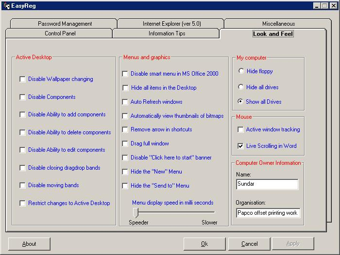

## Easy Registry

### Description

This code is meant for exposing the users to the registry.

This code will do more than you think. This software can be used for

security in the windows 9x/Me systems by disabling most of the features

if the user has not logged in correctly.

By using this program you can hide the background, screen saver,

settings pages in the display control panel, disable registry editing etc.

This program contains nearly 80 options of this kind and it is clearly shown

in the screen shot. Only a small part of the code is displayed in the screen shot.

As this is meant for security, you can password protect this application. Using this program

you can even reveal the passwords hidden under the astericks in the password text boxes

by just dragging an icon over it. This even has more restrictions for the IE also.

NOTE: At first run the passowrd to the program is "PleaseLogin" without the quotes.

I am sure, that this program will amaze you. So please vote for it.
 
### More Info
 
Actually, there is no input required. Just few clicks and you are done.

At the first run itself, the program will ask for the

password. Please provide the password as "PleaseLogin" without quotes.

Then you can change the password using the "Password management" tab in the program

itself.

The response of the program is editing the registry

automatically to provide many restrictions in windows.

Please remove all the restrictions you set before

uninstalling or deleting the program. Otherwise you have to do it

by manually editing the registry.

             |
---                |---
**Submitted On**   |2001-04-12 00:24:18
**By**             |[M\.Sundaravel](https://github.com/Planet-Source-Code/PSCIndex/blob/master/ByAuthor/m-sundaravel.md)
**Level**          |Intermediate
**User Rating**    |4.2 (25 globes from 6 users)
**Compatibility**  |VB 3\.0, VB 4\.0 \(16\-bit\), VB 4\.0 \(32\-bit\), VB 5\.0, VB 6\.0
**Category**       |[Registry](https://github.com/Planet-Source-Code/PSCIndex/blob/master/ByCategory/registry__1-36.md)
**World**          |[Visual Basic](https://github.com/Planet-Source-Code/PSCIndex/blob/master/ByWorld/visual-basic.md)
**Archive File**   |[Easy Regis182714122001\.zip](https://github.com/Planet-Source-Code/m-sundaravel-easy-registry__1-22347/archive/master.zip)

